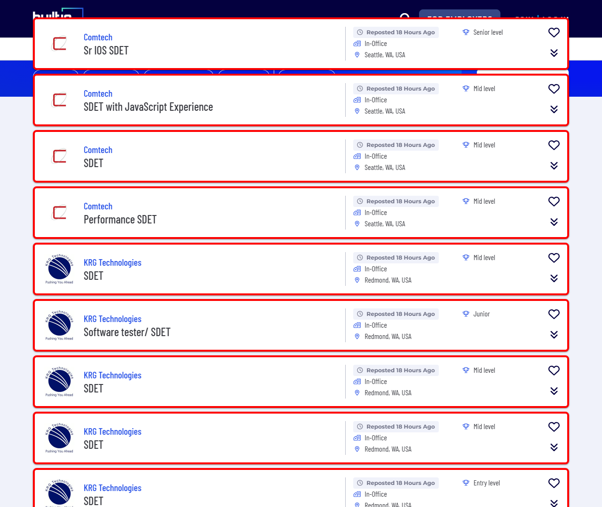

# Automated Job Scraper Walkthrough

Your custom, end-to-end automated job scraper is up and running! We built a unified pipeline that automatically checks your target job boards, finds job cards, evaluates the descriptions against your skillset, and seamlessly injects new roles directly into your dashboard and review lists.

## 1. The Crawler Learner V2 (`crawler_learner.py`)

Job boards update their CSS constantly. Hardcoding selectors into a scraper guarantees it will break in a few weeks. The `crawler_learner.py` script ensures you can always fix it in seconds.

**How the Visual Learner works:**
1. You run the script providing a target job board search URL and its Name.
   `python scripts/crawler_learner.py "https://builtin.com/jobs/seattle?search=SDET" "BuiltIn"`
2. The script launches a headless Chromium browser, opens the page, and scrolls it to load elements.
3. It heuristically parses the DOM to analyze class names for links, containers, and headers, and groups the most likely candidates into **enumerated, easy-to-read lists** in your terminal.
4. When you enter a number from the list (e.g., `1` for a potential job card container), the script dynamically uses Playwright to **draw a brightly colored border** around those elements on the web page and takes a screenshot!
5. It then asks you to view the screenshot in the `logs` folder and confirm if it captured the right elements.

Here is an example of the visual feedback when selecting a job card container:


6. Once you confirm the visual match for Cards, Titles, and URLs, it neatly formats and saves them into your `site_configs.json` file.

## 2. The Configuration File (`site_configs.json`)

This JSON stores all the selectors needed. Currently, BuiltIn is perfectly mapped:
```json
{
  "BuiltIn": {
    "domain": "builtin.com",
    "job_card_selector": ".job-bounded-responsive",
    "title_selector": ".fs-xl-2xl",
    "company_selector": ".company-title-clamp",
    "job_url_selector": "a.hover-underline"
  }
}
```
If you ever want to add Indeed or Dice, just run the learner script for those sites!

## 3. The Headless Scourer (`auto_scour.py`)

This is the production logic you can run daily via command line or cron job.
Run it via:
`python scripts/auto_scour.py`

**What it does instantly in the background:**
- Connects browserless using Playwright.
- Traverses every site mapped in your `site_configs.json` and navigates to the URL from `job_search_sites.json`.
- Grabs the job cards using your selectors.
- Navigates to each job posting, extracts the full text description, and dynamically passes it to `scripts/filter_skills.py` to evaluate your core competencies vs disqualified skills (like Python).
- **Auto-Updates Tracking:** If a job passes, it gets formatted as HTML and appended strictly inside your `dashboard.html` array and your `jobs_to_review.md` table!
- **Auto-Discards:** Disqualified roles get appended to the bottom section of your markdown file.
- Finally, it prints the required "Google Sheet" URLs to the terminal so you can copy and paste them into your tracker!

> [!TIP]
> All run outputs are saved to `logs/auto_scour_results.json` so you have a historic backup of what the script found under the hood!
